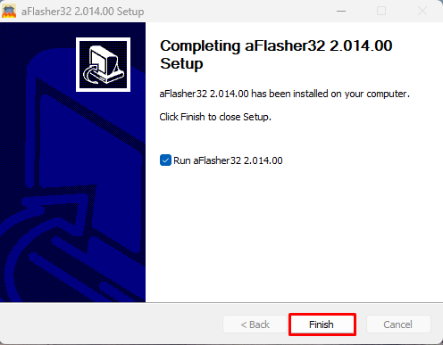
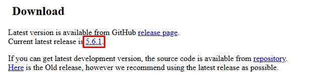

# Geliştirme Ortamı Kurulumu

Bu rehber, **Tiremo Cortex** ile çalışmak için gereken ABOV araçlarının kurulumunu anlatır. Staja başlamadan önce aşağıdaki kurulumları tamamla.

---

## İçindekiler

- [Gerekli araçlar](#gerekli-araçlar)
- [1. eMStudio32 kurulumu](#1-emstudio32-kurulumu)
- [2. MCUBrew32 kurulumu](#2-mcubrew32-kurulumu)
- [3. aFlasher32 kurulumu](#3-aflasher32-kurulumu)
- [4. Tera Term kurulumu](#4-tera-term-kurulumu)

---

## Gerekli araçlar

| Araç | Ne işe yarar |
|------|----------------|
| **eMStudio32** | ABOV mikrodenetleyiciler için IDE (yaz, derle, debug) |
| **MCUBrew32** | Proje oluşturma ve çevre birimi / pin ayarı |
| **aFlasher32** | Derlenmiş HEX dosyasını karta yükleme |
| **Tera Term** | Seri port (UART) üzerinden terminal |

Önerilen kurulum yolu: `C:\ABOV\eMStudio32` ve `C:\ABOV\MCUBrew32`

---

## 1. eMStudio32 kurulumu

eMStudio32, ABOV mikrodenetleyiciler için entegre geliştirme ortamıdır. Kod yazma, derleme ve hata ayıklama tek arayüzden yapılır.

### Kaynaklar

- **İndirme:** [ABOV Tools — eMStudio32](https://www.abov.co.kr/en/tools_support/debug_tools.php?category=eMStudio32)
- **Kullanım kılavuzu:** [eMStudio32 Manual](https://abov.atlassian.net/wiki/spaces/ES2/pages/1558413356/Manual+Release)
- **Kurulum adımları:** [eMStudio32 Installation](https://abov.atlassian.net/wiki/spaces/ES2/pages/1752858627/Installation)
- **Yerel PDF:** [ES2 Installation](Document/ES2-Installation-200526-125944.pdf)

### Kurulum adımları

1. Yukarıdaki indirme sayfasından kurulum dosyasını indir.
2. Kurulumu çalıştır ve adımları tamamla.
3. [Kurulum dokümanındaki](https://abov.atlassian.net/wiki/spaces/ES2/pages/1752858627/Installation) yönergeleri izle.
4. **eMStudio32’yi Başlat menüsü / masaüstü kısayolundan aç** — klasörü rastgele bir Eclipse ile açma.
5. Kurulumdan sonra `make.exe` dosyasının varlığını kontrol et:

```
<eMStudio32 kurulum>\bin\xpack-windows-build-tools-*\bin\make.exe
```

Tipik konumlar:

- `C:\ABOV\eMStudio32\`
- `C:\Program Files (x86)\ABOV\eMStudio32\`

### Sık karşılaşılan hatalar

| Hata | Olası neden | Çözüm |
|------|-------------|--------|
| `Program "make" not found in PATH` | Build tools eksik veya IDE resmi kısayoldan açılmamış | eMStudio32’yi yeniden kur / resmi kısayoldan aç; `make.exe` yolunu kontrol et |
| PATH ile kurulum klasörü uyuşmuyor | Kısmi kurulum veya kopyalanmış workspace | Tek bir konuma kur veya doğru `xpack-windows-build-tools-*\bin` yolunu PATH’e ekle |
| `ld.exe: unrecognized option '--no-warn-rwx-segment'` | Bayrak GCC 12+ ister; eMStudio32 ile gelen **GCC 10.3** | Projeyi olduğu gibi kullan; **Project → Clean…** sonra **Build** |

> Tiremo projeleri eMStudio32 ile gelen **GNU Arm Embedded Toolchain (GCC 10.3)** ile test edilmiştir.

---

## 2. MCUBrew32 kurulumu

MCUBrew32, ABOV projelerinde pin, saat ve çevre birimi ayarı yapıp kod üreten araçtır.

### Kaynaklar

- **İndirme:** [ABOV Tools — MCUBrew32](https://www.abov.co.kr/en/tools_support/debug_tools.php?category=mcubrew32)
- **Kullanım kılavuzu:** [MCUBrew32 User Guide](https://abov.atlassian.net/wiki/spaces/MCUBrew321/pages/760250452/Manual+Release)
- **Kurulum:** [Installation and Getting Started](https://abov.atlassian.net/wiki/spaces/MCUBrew321/pages/1379565598/Installation+and+Getting+Started)
- **Yerel PDF:** [MCUBrew32 Installation](Document/MCUBrew321-Installing%20and%20uninstalling%20the%20MCUBrew32%20program-200526-123146.pdf)

### Kurulum adımları

1. İndirme sayfasından kurulum dosyasını indir.
2. Kurulumu çalıştır ve adımları izle.
3. Kurulum kılavuzunda **6. adımda** “Installation Complete” görünce kurulum bitmiştir.

---

## 3. aFlasher32 kurulumu

aFlasher32, derlenmiş **HEX** dosyasını **Tiremo Cortex** kartına yüklemek için kullanılır.

### Kurulum adımları

**1 —** [ABOV Tools — aFlasher32](https://www.abov.co.kr/en/tools_support/debug_tools.php?category=aflasher32) sayfasına git.


**2 —** *All Tools & Support (Downloadable)* altında **aFlasher32 Executable** `.exe` dosyasını indir.

**3 —** İndirilen `.zip` içinden kurulum `.exe` dosyasını çıkar ve çalıştır.

**4 —** Kurulumu tamamla:

- **Next** ile ilerleme  
  
- Lisansı kabul et  
  
- Kurulum konumunu seç → **Install**  
  
- **Finish**  
  

---

## 4. Tera Term kurulumu

Tera Term, Tiremo Cortex ile **seri port** üzerinden konuşmak için kullanılan terminaldir. İstersen başka bir seri terminal de kullanabilirsin.

### Kurulum adımları

**1 —** [https://teratermproject.github.io/index-en.html](https://teratermproject.github.io/index-en.html) adresine git.

**2 —** **Download** altından son sürümü seç.



**3 —** Release sayfasında **installer** bölümünden kurulum dosyasını indir.


**4 —** `.exe` dosyasını çalıştırıp kurulumu bitir.

---

## Kurulum tamam ✓

Araçlar kurulduktan sonra mentör ilk proje oluşturmayı gösterir; ardından GPIO anlatımına ve görevlere geçilir.
