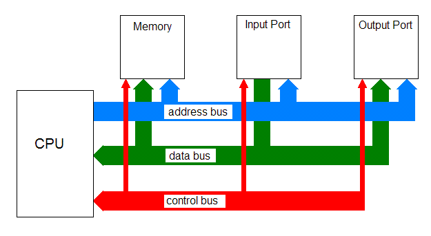
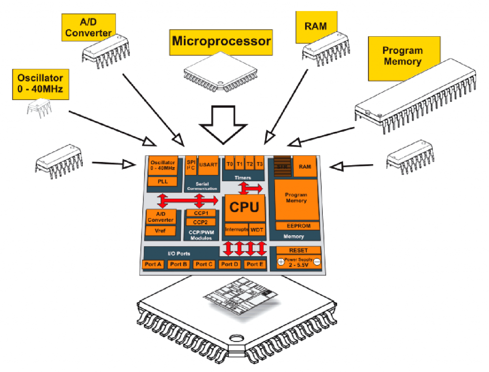

# Mikroişlemci (MPU) ve Mikrodenetleyici (MCU)

Temel kavramlar, bellek (RAM / Flash) ve sistem saati

Bu notu okuyarak MPU ile MCU farkını, belleğin nerede durduğunu ve staj kartındaki çipin neden bir **MCU** olduğunu öğreneceksin. RAM, Flash, GPIO ve debounce örnekleri **MCU** bölümünde; mikroişlemci kısmı sadece farkı netleştirmek için kısa. Kartın: **ABOV A34G43x** (Tiremo Cortex).

### Bu notu nasıl kullanmalısın?

1. **İlk tablo + resim1:** MPU — bellek dışarıda; resimdeki kutuları ezberle değil, “bus ile bağlı” diye anla.  
2. **MCU + resim2:** Flash/RAM/GPIO aynı çipte; dün yazdığın `led_on`, `press_count` **SRAM**’dedir.  
3. **§3 debounce örneği:** Kodu satır satır oku; `GetTickMs()` ile 20 ms eşiğini görevlerde kullan.  
4. [`02_Gorevler.md`](02_Gorevler.md): kısa/uzun basış için `uint32_t` süre ölçümü.

### Gün sonu hedefleri

- MPU ile MCU’yu tabloyla ayırt edebilmek (bellek nerede?).  
- Bir değişkenin **RAM**’de, `const` ve fonksiyon kodunun **Flash**’ta olduğunu söyleyebilmek.  
- Debounce mantığını (zaman damgası + stabil okuma) açıklayabilmek.

---

## İki kavramı baştan ayır

Sık yapılan hata: “mikroişlemci” deyince RAM, Flash ve GPIO’nun da aynı çipin içinde sanılması. Klasik ayrım şöyle:

| | **Mikroişlemci (MPU)** | **Mikrodenetleyici (MCU)** |
|---|------------------------|----------------------------|
| **Çipte ne var?** | CPU, cache, register’lar, bus arabirimleri | CPU + Flash + SRAM + GPIO + Timer + UART/SPI/I²C + ADC… |
| **Bellek nerede?** | Çoğunlukla **harici** (ayrı RAM / Flash çipleri) | Çoğunlukla **aynı çipte** |
| **Tek başına çalışır mı?** | Hayır — etrafına bellek ve çevre birimi gerekir | Evet — tek çip yeterli olabilir |
| **Yazılım modeli** | Linux, Windows, Android gibi OS çalıştırabilir | Bare-metal veya RTOS |
| **Örnek** | Intel Core, AMD Ryzen, ARM Cortex-A53 | STM32, ESP32, **ABOV A34G43x (kartınız)** |
| **Saat / bellek ölçeği** | GHz, GB | MHz, KB–MB |

**Özet:** Kartındaki çip bir **MCU**. Mikroişlemciyi “neden dışarıda RAM ister?” diye anlıyoruz; staj boyunca asıl mimari MCU.

---

## 1. Mikroişlemci (MPU) nedir?

Mikroişlemci (**MPU** — *Microprocessor Unit*), programcının yazdığı komutları yorumlayıp yerine getiren mantıksal birimdir. Yapısında tipik olarak **CPU**, **ön bellek (cache)**, **register’lar** ve dış dünyaya açılan **bus arabirimleri** bulunur. Özetle bilgisayarın “beyin” çipidir: komut alır, işler, sonucu ilgili birimlere iletir.

### Kritik nokta — tek başına sistem değildir

Mikroişlemci **tek başına çalışan bir sistem değildir**. Programı çalıştırabilmesi için RAM’e ve program belleğine ihtiyaç duyar. Bu bellekler klasik bir MPU sisteminde çoğunlukla **mikroişlemcinin dışında** bulunur. CPU onlara **Address Bus, Data Bus ve Control Bus** üzerinden erişir.

Doğru zihinsel model:

```
           +----------------+
           | Mikroişlemci   |
           |                |
           |     CPU        |
           |   Cache        |
           +-------+--------+
                   |
        Address / Data / Control Bus
                   |
        +----------+----------+
        |          |          |
   +----+--+  +----+---+  +---+---+
   | RAM   |  | Flash  |  | GPIO  |
   |       |  | (veya  |  | / I/O |
   |       |  | başka  |  | port  |
   |       |  | depo)  |  |       |
   +-------+  +--------+  +-------+
```

Yani şöyle **okunmamalı**:

```
Mikroişlemci
├── CPU
├── RAM      ← yanlış algı
└── ROM      ← yanlış algı
```

Doğrusu: mikroişlemci = CPU (+ cache + register + bus arayüzü); RAM / program belleği / GPIO çoğu zaman **ayrı bileşenler**dir ve bus ile bağlanır.



*Şekil: CPU solda; Memory, Input Port, Output Port dışarıda. Address, Data, Control bus ile bağlanır. Bellek MPU’nun “içinde” değil, sistemin parçasıdır.*

### CPU, ALU, register (MPU içinde olanlar)

Mikroişlemcinin beyni **CPU**’dur. Veri işleme buradan yürür. Aritmetik ve lojik işlemler **ALU** (*Arithmetic Logic Unit*) içinde yapılır: toplama, çıkarma, karşılaştırma, AND/OR…

CPU içinde **8 / 16 / 32 / 64 bit register**’lar vardır. Bunlar çok hızlı, çok küçük, **çipin içinde** geçici depolardır. Derleyici `a + 1` gibi ifadelerde ara değerleri çoğu zaman register’larda tutar. Bu register’lar harici RAM değildir; MPU paketinin içindedir.

CPU’nun görevi: (harici veya sistem) bellekteki programı bulmak, komutları çağırmak ve çalıştırmaktır. Veri önce sistem belleğine gelir; CPU o belleğe bus üzerinden erişir.

### Bus — MPU’yu dış dünyaya bağlayan yollar

**Address BUS**  
Tek yönlü. “Hangi adrese okuyacağım / yazacağım?” bilgisini taşır. Adres CPU’dan RAM, Flash veya I/O portuna gider.

**Data BUS**  
Çift yönlü. Asıl veri (byte’lar) CPU ↔ bellek / port arasında akar.

**Control BUS**  
Oku / yaz / enable / interrupt gibi kontrol sinyalleri. Birimler arası senkronu düzenler.

Resim1 tam olarak bunu anlatır: Memory ve portlar CPU’nun yanında ayrı kutulardır.

### MPU’da program ve veri nerede yaşar? (kısa, doğru cümle)

Program çalışırken değişkenler **sistemde bulunan RAM’de** tutulur. Mikroişlemci bu RAM’e **veri yolu (bus) üzerinden** erişir. “Mikroişlemcinin içindeki RAM’de tutulur” demek klasik MPU için yanlıştır.

Aynı şekilde program deposu da çoğu zaman CPU paketinin dışında bir Flash, eMMC, SSD veya SD karttır. Örnek: bir tek-kart bilgisayarda kod dosya sisteminde / SD’de, çalışma verisi LPDDR RAM çipinde, CPU ayrı bir SoC çekirdeğidir — “CPU kılıfının içinde RAM+Flash” demek değildir.

MPU örnekleri: Intel Core, AMD Ryzen, birçok ARM Cortex-A tabanlı uygulama işlemcisi. Bunlar Linux / Windows / Android çalıştırabilir; etraflarında GB mertebesinde harici bellek vardır.

Buraya kadar MPU yeterli. Staj kodu, Flash’a yükleme, GPIO, LED/buton ve debounce bir sonraki başlıkta (MCU).

---

## 2. Mikrodenetleyici (MCU) nedir?

Mikrodenetleyici (**MCU**, **µC**), belirli bir görevi yerine getirmek için tasarlanmış, genellikle küçük ve düşük maliyetli bir bilgisayar sistemidir. Tek bir **entegre devre (IC)** içinde şunları bir arada barındırır:

- İşlemci (CPU — küçük bir mikroişlemci çekirdeği)
- Program belleği (Flash / ROM)
- Veri belleği (SRAM / RAM)
- Giriş/çıkış (GPIO ve diğer I/O)
- Timer / sayıcılar
- Seri birimler (UART, SPI, I²C…)
- Sıklıkla ADC, PWM, interrupt denetleyicisi, watchdog
- Saat / osilatör (dahili ve/veya harici kristal bağlantısı)

Mikrodenetleyiciler **gömülü sistemlerde** kullanılır; belirli bir cihazı kontrol etmek için programlanırlar. **Tek başına çalışabilirler** — bare-metal veya RTOS ile. Staj kartınızdaki **ABOV A34G43x** bir MCU’dur. Dün LED yaktığınız ve butonu okuduğunuz birim budur.



*Şekil: Üstte ayrı parçalar (osilatör, ADC, mikroişlemci, RAM, program belleği). Ortada hepsi tek MCU bloğunda. Altta fiziksel paket. Bu, MPU diyagramının tersidir: bellek ve I/O artık “dış kutu” değil, çipin içi.*

### MCU’nun temel özellikleri

**1. CPU**  
Merkezi işlem birimi. `main`, `while(1)`, `if` kararları, debounce mantığı burada çalışır.

**2. Bellek (çip içinde)**  
- **Flash / program belleği:** Kod ve genelde `const` sabitler. Kalıcıdır; güç kesilince silinmez.  
- **RAM (SRAM):** Değişkenler, diziler, yığın (stack), çalışma anı state’i. Güç/reset ile içeriği kaybolur.

**3. I/O**  
LED, buton, sensör, motor. GPIO pin’leri (şekilde Port A–E) buna karşılık gelir.

**4. Saat (Clock)**  
Zamanlama ve hız. Blink, debounce süresi, kısa/uzun basış eşiği tick’lere dayanır.

**5. Kristal / osilatör**  
Sabit frekans referansı. Dahili osilatör veya harici kuartz kristal.

### MPU vs MCU — farkları madde madde

- MPU genel amaçlı, yüksek işlem gücü; MCU gömülü ve özel görev.
- MPU’da CPU (+ cache) öne çıkar, bellek/çevre çoğu **dışarıda**; MCU’da Flash, RAM, timer, ADC, portlar **aynı çipte** (resim2).
- MPU daha çok güç yer, pahalı/büyük sistem; MCU düşük güç, ucuz, küçük.
- MPU çoğunlukla **GHz** ve **GB** bellek; MCU **MHz** ve **KB–MB**.
- Bu yüzden gömülüde `samples[8]` gibi küçük buffer’lar yeterlidir; bilgisayar tarzı büyük yapılar uygun değildir.

---

## 3. MCU mimarisi — stajın asıl konusu

Bundan sonraki tüm C++ örnekleri **mikrodenetleyici (kartınız)** içindir. “RAM’de tutulur” dediğimizde kastettiğimiz: **MCU çipinin içindeki SRAM**.

### MCU’da RAM — değişkenler, diziler, state

Program çalışırken şu tür veriler **MCU içindeki RAM’de** tutulur:

```cpp
bool led_on = false;           // değişken → MCU SRAM
uint32_t press_count = 0;      // sayaç → MCU SRAM
uint8_t samples[8];            // dizi → MCU SRAM (debounce örnekleri)
bool history[5] = {};          // ardışık buton okumaları → MCU SRAM
```

Reset veya güç kesilince bu değerler kaybolur; program Flash’tan yeniden başlar, değişkenler yeniden ilklenir.

ALU / CPU tarafında işlenen ifadeler (MCU CPU’su):

```cpp
press_count = press_count + 1;   // aritmetik
if (raw == last_raw) { ... }     // karşılaştırma
led_on = !led_on;                // lojik
```

Ara değerler CPU register’larında (çip içi, çok hızlı); kalıcı olmayan program state’i RAM’de.

### MCU’da Flash — kod ve sabitler

```cpp
const uint16_t DEBOUNCE_MS = 20;   // genelde Flash (read-only)
const uint8_t  LED_COUNT   = 3;

void Led_Toggle(void)
{
    // fonksiyonun makine kodu → MCU Flash
}
```

**Build alıp karta yüklemek = MCU’daki Flash’ı güncellemek** demektir. Bu ifade **mikrodenetleyici** (ABOV, STM32, ESP32 vb.) için doğrudur; genel bir MPU / PC için genellenmez.

Elektrik kesilse de kod Flash’ta kalır; açılışta CPU yine oradan çalıştırır.

### MCU’da GPIO — pin register’ları

MCU içinde GPIO birimi, bellek haritasında özel adreslerdeki register’lardır. Driver sizin yerinize yazar/okur:

```cpp
Gpio_Write(LED1, 1);              // çıkış: port register bit set
bool pressed = Gpio_Read(BTN);    // giriş: input data register oku
```

MCU’da da içeride Address/Data/Control benzeri yollar vardır; fakat RAM ve GPIO çoğu zaman **aynı silikon die üzerindedir** — harici anakart bus’ı değildir (MPU’daki gibi ayrı RAM çipi şart değildir).

### MCU çalışma prensibi

1. C kaynak (`.c`) derlenir → link → binary.  
2. Binary **MCU Flash**’a yüklenir.  
3. Reset → startup → `main`.  
4. Clock / GPIO init.  
5. `while (1)` içinde oku / karar ver / yaz. Geçici state **MCU RAM**’de.

```cpp
int main(void)
{
    System_Init();   // saat / temel altyapı (MCU)
    Gpio_Init();     // LED çıkış, buton giriş

    while (1)
    {
        if (Button_ReadDebounced()) {
            Led_Toggle();
        }
    }
}
```

Gömülü program “bitmez”; cihaz yaşadığı sürece döngü sürer.

### Kesme (interrupt) — MCU

Kesme, MCU’nun belirli olaylara hızlı tepki vermesini sağlar. Ana iş bırakılır, ISR çalışır, sonra devam edilir.

```cpp
volatile bool button_flag = false;   // flag → MCU RAM

void Button_IRQHandler(void)
{
    button_flag = true;   // ISR kısa; asıl iş main'de
}
```

Bugün debounce için önce **polling** + zaman ölçümü yeterlidir.

```cpp
static bool last_raw = false;          // MCU RAM
static bool stable = false;            // MCU RAM
static uint32_t last_change_ms = 0;    // MCU RAM

bool Button_ReadDebounced(void)
{
    bool raw = Gpio_ReadButton();      // GPIO (MCU içi birim)
    uint32_t now = GetTickMs();        // timer / tick (MCU)

    if (raw != last_raw) {
        last_raw = raw;
        last_change_ms = now;
    }
    if ((now - last_change_ms) >= 20) {
        stable = raw;
    }
    return stable;
}
```

Anlık pin GPIO’dan gelir; geçmiş / stabil durum / zaman damgası **MCU RAM** değişkenlerindedir; fonksiyon kodu **MCU Flash**’tadır.

---

## 4. Sistem saati (MCU)

**Sistem saati (Clock)**, MCU’nun ve dijital blokların senkron çalışmasını sağlayan zamanlama sinyalidir. Frekans Hz cinsinden osilasyon yapar; işlemci her darbeyle bir sonraki adıma geçebilir (basitleştirilmiş model). Hız sistem saatiyle belirlenir; osilatör üretir, çip içinde dağıtılır.

| Ne yapıyorsunuz? (MCU) | Clock ile ilişkisi |
|------------------------|--------------------|
| LED 500 ms blink | Tick ile gecikme |
| Debounce 20 ms | Aynı tick |
| Kısa &lt; 1 s / uzun ≥ 1 s | `GetTickMs()` eşiği |
| UART baud | Bit süresi clock’tan |

```cpp
uint32_t t0 = GetTickMs();
while ((GetTickMs() - t0) < 20) {
    // 20 ms — MCU timer / sistem tick
}
```

### Saat kaynakları (MCU’da yaygın isimler)

Birçok MCU ailesinde benzer mantık şu adlarla anılır:

**Dahili**

- **HSI** (*High-Speed Internal*): ~8–16 MHz. Harici kristal olmadan hızlı start; basit GPIO/LED için uygun.
- **LSI** (*Low-Speed Internal*): ~32 kHz. RTC, watchdog, düşük güç.

**Harici**

- **HSE** (*High-Speed External*): ~4–26 MHz kristal/osilatör. Daha hassas zaman; USB vb.
- **LSE** (*Low-Speed External*): çoğu zaman **32.768 kHz**. Hassas RTC.

**PLL**  
Kaynak (HSI veya HSE) üzerinden frekansı çarpar / böler; sistem saatini yükseltir veya sabitleştirir. Peripheral’lar için ara frekanslar da buradan türetilir.

```
HSI veya HSE → PLL (isteğe bağlı) → sistem saati → CPU / bus / timer
```

Örnek projede clock / `System_Init` fonksiyonunu açıp saat ayarının nerede yapıldığına bakman yeterli; şimdilik register detayına inmen gerekmez.

---

## 5. `.c` / `.cpp` ve `.h` (MCU projesi)

Bu dosya ayrımı hem C hem C++ MCU projelerinde aynı mantıktadır.

| Uzantı | Ne içerir? |
|--------|------------|
| `.c` / `.cpp` | Fonksiyon gövdeleri (implementation) |
| `.h` | Prototipler, `enum`, `struct`, sabitler |

Drivers / örnek klasöründen bu dosyalara erişebilirsin. IDE’de fonksiyon adına **Ctrl + sağ tık** (Go to Definition) ile `.h` veya `.cpp` içindeki tanıma gidebilirsin.

```cpp
// button.h
#pragma once

enum class ButtonEvent {
    None,
    Press,
    Release,
    Long
};

void Button_Init(void);
ButtonEvent Button_Update(void);
```

```cpp
// button.cpp
#include "button.h"

static bool stable = false;     // MCU RAM — dosya içi
static uint32_t down_ms = 0;    // MCU RAM

void Button_Init(void) { /* GPIO input */ }

ButtonEvent Button_Update(void)
{
    // debounce + kısa/uzun
    return ButtonEvent::None;
}
```

```cpp
// main.cpp
#include "button.h"

int main(void)
{
    System_Init();
    Button_Init();

    while (1) {
        ButtonEvent e = Button_Update();
        if (e == ButtonEvent::Press) { /* LED toggle */ }
        if (e == ButtonEvent::Long)  { /* farklı pattern */ }
    }
}
```

---

## 6. Init ve fonksiyon prototipi (MCU)

`main` başında sistem ayağa kalkar. İsim toolchain’e göre değişir (`System_Init`, `HAL_Init`, kart SDK’sı…). Sıra: **clock / temel altyapı → GPIO → `while(1)`**.

```cpp
int main(void)
{
    System_Init();
    SystemClock_Config();
    Gpio_Init();

    while (1) {
        /* uygulama */
    }
}
```

### Prototip neden gerekli?

C/C++’ta fonksiyon ya çağrıdan önce tanımlanır ya da **prototip** ile bildirilir. Aksi halde derleyici imzayı bilmez.

```cpp
void SystemClock_Config(void);   // prototip
void Gpio_Init(void);

int main(void)
{
    SystemClock_Config();
    Gpio_Init();
    while (1) { }
}

void SystemClock_Config(void) { /* saat */ }
void Gpio_Init(void)          { /* LED out, buton in */ }
```

Prototipleri `.h` içinde tutmak okunabilirliği ve paylaşımı artırır.

---

## 7. Bugünün pratiğine köprü

Görevler: [`02_Gorevler.md`](02_Gorevler.md) — hepsi **MCU** üzerinde.

| Görev | Bağ |
|-------|-----|
| Buton → LED | MCU GPIO |
| Debounce | MCU RAM state + clock tick |
| Kısa / uzun basış | MCU RAM’de `down_ms` |
| PRESS / RELEASE / LONG | `enum class` + state (MCU RAM) |

**Aklında kalsın:**

1. **MPU** = CPU (+ cache, register, bus); RAM/Flash çoğu **dışarıda**, bus ile erişilir (resim1).  
2. **MCU** = CPU + Flash + RAM + GPIO + … **tek çipte**; kartın budur (resim2).  
3. `led_on`, `samples[]` → **MCU RAM**; `Led_Toggle` kodu → **MCU Flash**.  
4. Karta yüklemek = **MCU Flash** güncellemek.  
5. Saat yoksa debounce / basış süresi ölçülemez.

Sonraki adım: [`02_Gorevler.md`](02_Gorevler.md).  

