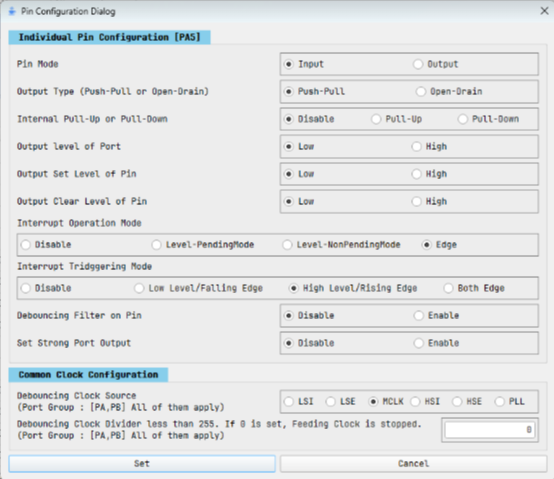

# Kesme (Interrupt), Harici Kesme ve NVIC

Kesme mekanizması, öncelik yönetimi ve pin kenar ayarları

Bu notu okuyarak kesmenin ne olduğunu, harici kesmeyi ve **NVIC**’i öğreneceksin. Kartın **ARM Cortex-M** tabanlı bir **MCU** (ABOV A34G43x); NVIC bu çekirdek ailesinde yerleşiktir. Pazartesi (GPIO) ve Salı (debounce, RAM/Flash) bilgine bağlayarak ilerle; bitince [`02_Gorevler.md`](02_Gorevler.md).

### Bu notu nasıl kullanmalısın?

1. **§1–3:** Kavram — polling vs kesme, ISR, NVIC (okuma, kod yazma yok).  
2. **§5 + resim3:** Pin config penceresinde her satırın ne işe yaradığını kartınla eşleştir.  
3. Örnek projede `IRQHandler`, `NVIC_EnableIRQ`, `EXTI` araması yap.  
4. [`02_Gorevler.md`](02_Gorevler.md): önce flag + `main`, sonra tam kesme; rapordaki **10 teori sorusu** için bu notu kaynak göster.

### Gün sonu hedefleri

- Polling ile kesme arasındaki farkı **bir cümleyle** söyleyebilmek.  
- ISR’da neden **kısa** kod yazıldığını açıklayabilmek.  
- Pull-up butonda neden **Falling Edge** seçildiğini anlatmak.  
- `volatile bool flag` kullanımını Salı’daki RAM paylaşımı ile bağlayabilmek.

---

## Bugün ne öğreneceksin?

| Önceki günler | Bugün |
|---------------|--------|
| Pazartesi: GPIO — LED yaz, buton **oku** (polling) | Buton olayını **kesme** ile yakala |
| Salı: Debounce, kısa/uzun, event (döngüde) | ISR + flag; NVIC’in rolü |
| Salı: RAM’de state, Flash’ta kod | ISR kısa tutulur; asıl iş `main` / RAM flag |

**Kısa özet:** Polling = sen sürekli sorarsın. Kesme = olay gelince MCU seni çağırır.

---

## 1. Kesme (interrupt) nedir?

**Interrupt (kesme)**, normal program akışını geçici olarak durdurup öncelikli bir olayı işleten mekanizmadır.

`while(1)` içinde LED yakıyorsun / sayaç artıyorsun. O sırada butona basıldı. İki yol:

| Yöntem | Ne yaparsın? | Artı / eksi |
|--------|--------------|-------------|
| **Polling** | Her turda `Gpio_Read(BTN)` | Basit; CPU sürekli kontrol eder, olayı kaçırabilir veya geç fark eder |
| **Kesme** | Pin kenarında donanım seni uyandırır → ISR çalışır | Olay anında tepki; `main` başka işe bakabilir |

Kesme geldiğinde işlemci (MCU içindeki CPU) mevcut işi bırakır, o kesmeye özel kodu çalıştırır, bitince **kaldığı yerden** devam eder.

### Genel çalışma sırası

1. **Olay olur** — butona basıldı, timer doldu, UART’tan byte geldi…  
2. **Kesme sinyali** — ilgili birim CPU’ya “bak buraya” der.  
3. **ISR çalışır** — *Interrupt Service Routine* (kesme işleyicisi): senin yazdığın kısa fonksiyon.  
4. **Geri dönüş** — CPU, kesilmeden önceki komuta döner.

```
main / while(1)  ----->  (kesme!)  ----->  ISR()  ----->  kaldığın yere dön
     |                                          |
     |         bağlam (register'lar) kaydedilir  |
     +------------------------------------------+
```

**Gerçekçi örnek (kartınız):**  
Ana döngüde LED chase çalışıyor. Butona basılınca ISR sadece `button_flag = true` yazar. Döngü flag’i görünce yön değiştirir. ISR içinde uzun `delay` veya karmaşık iş **yapılmaz**.

```cpp
volatile bool button_flag = false;   // MCU RAM — ISR ile main paylaşır

void Button_IRQHandler(void)
{
    button_flag = true;   // ISR: kısa tut
    // kesme bayrağını temizle (cihaza göre ClearPending / clear EXTI)
}

int main(void)
{
    System_Init();
    Gpio_Init();
    Exti_Button_Init();   // pin → kenar → NVIC enable

    while (1) {
        if (button_flag) {
            button_flag = false;
            // asıl iş burada: LED toggle, yön değiştir...
        }
        // chase / başka iş
    }
}
```

`volatile`: derleyiciye “bu değişken ISR tarafından da değişebilir, optimize edip yok sayma” der.

---

## 2. Harici kesme (external interrupt)

**Harici kesme**, MCU’nun **dış dünyasından** gelen olayla tetiklenen kesmedir. Tipik kaynak: GPIO pin’ine bağlı buton, sensör, başka bir çipten gelen sinyal.

- Pin **giriş** olarak ayarlanır.  
- Belirli bir **kenar** veya **seviye** seçilir (aşağıda resim3).  
- Bu olay, kesme hattı üzerinden **NVIC**’e düşer.  
- NVIC, ilgili **ISR**’ı çalıştırır.

Salı günü butonu döngüde okuyordunuz. Bugün aynı buton “basıldığı anda” (veya bırakıldığı anda) kesme üretecek — sürekli sormaya gerek kalmaz.

**Dikkat — bounce:** Mekanik buton hâlâ sıçrar. Kesme, her sıçramada birden fazla ISR tetikleyebilir — Salı’da döngüde gördüğün 0–1–0 dizisinin her geçişi ayrı **kenar** sayılabilir.

| Yaklaşım | Ne yaparsın? | Artı / eksi |
|----------|--------------|-------------|
| Donanım debounce (resim3) | Pin filtresi açık | ISR sayısı azalır; clock ayarı gerekir |
| ISR’da zaman damgası | Son ISR’dan X ms geçmeden yok say | ISR biraz uzar; dikkatli yaz |
| Flag + `main` | ISR sadece “bir şey oldu” der; Salı debounce `main`’de | ISR en kısa; bugün için iyi model |

Pratik öneri: Öğrenirken **ISR = `button_flag = true` + clear pending**; LED toggle ve debounce **kesinlikle `main`** içinde kalsın.

---

## 3. NVIC nedir?

**NVIC** (*Nested Vectored Interrupt Controller*), ARM Cortex-M çekirdeklerinde yerleşik **kesme kontrol birimidir**. Görevi:

- Hangi kesmelerin açık / kapalı olduğunu yönetmek (**maskeleme**)  
- Aynı anda veya peş peşe gelen kesmelerde **öncelik** kararını vermek  
- Doğru ISR adresine dallanmak (**vectored**: her kesmenin vektör tablosunda bir adresi vardır)  
- Gerektiğinde bir ISR çalışırken daha yüksek öncelikli kesmenin araya girmesine izin vermek (**nested**)

```
  GPIO EXTI / Timer / UART / ...     (kesme kaynakları)
              \       |       /
               \      |      /
                v     v     v
            +------------------+
            |      NVIC        |  ← öncelik + enable/disable
            +--------+---------+
                     |
                     v
                  CPU → ilgili ISR
```

**Nested (yuvalanma) örneği:**  
Ana program çalışıyor → öncelik 5 harici kesme ISR’ı başladı → daha yüksek öncelikli (ör. 2) bir kesme geldi → ilk ISR durur, yüksek öncelikli biter, sonra düşük öncelikli ISR tamamlanır, en sonda `main`’e dönülür.

Öncelik numarası üreticiye / API’ye göre “küçük sayı = yüksek öncelik” olabilir; dokümantasyona bakın. Önemli olan fikir: **NVIC sırayı yönetir, sen önceliği ayarlarsın.**

Cortex-M MCU’larda onlarca maskelenebilir kesme kanalı ve yazılımla ayarlanabilir öncelik seviyeleri bulunur (sayı çipe göre değişir). Gecikme düşüktür: olay ile ISR giriş arası kısa tutulur — gömülü kontrol için uygundur.

**Özet:** Buton, timer, UART gibi kaynaklar kesme üretir; **NVIC** hangisinin önce işleneceğine karar verir (trafik polisi gibi).

**Senin yazdığın kodda NVIC nerede?** Genelde `Init` fonksiyonunda: “şu EXTI kanalını aç, önceliği şu olsun” dersin. ISR’ın **adı** vektör tablosunda sabittir; yanlış isim veya enable unutulursa kesme hiç gelmez — görevlerde ilk kontrol listesi budur.

**ISR çalışırken `main` ne olur?** O anki komut yarım kalır; CPU register’ları donanım tarafından saklanır, ISR biter, kaldığın yere dönülür. Bu yüzden ISR uzun olursa chase/blink **takılır** gibi görünür.

---

## 4. Polling vs kesme — ne zaman hangisi?

| Soru | Polling | Kesme |
|------|---------|--------|
| Butonu ne sıklıkla kontrol? | Her döngü | Sadece olay anında |
| CPU meşguliyeti | Sürekli okuma | ISR + flag |
| Kod karmaşıklığı | Daha basit | NVIC + ISR + bayrak temizleme |
| Salı debounce / uzun basış | Döngüde doğal | ISR kısa; süre ölçümü `main` veya timer |

Bugün pratikte: buton → harici kesme → flag → `main`’de LED. İleride timer/UART kesmeleri aynı NVIC mantığıyla gelecek.

---

## 5. Harici kesme pin ayarları

Araçta (MCUBrew / pin config) bir pin’i açınca benzer bir pencere görürsünüz. Buton için tipik yol: pin **Input**, interrupt **Edge**, tetik **Rising** veya **Falling** (şemanıza göre).



### Parametreler — ne işe yarar?

Aşağıdaki isimler araçtaki gibi; mantık diğer MCU’larda da benzerdir.

#### Pin Mode — Input / Output

| Seçim | Anlamı | Buton / LED |
|-------|--------|-------------|
| **Input** | Pin’i okursun | **Buton → Input** |
| **Output** | Pin’e yazarsın | LED → Output |

Harici kesme için pin **Input** olmalıdır.

#### Internal Pull-Up / Pull-Down / Disable

| Seçim | Pin boştayken | Tipik buton (GND’ye basınca) |
|-------|---------------|------------------------------|
| **Pull-Up** | HIGH (~1) | Basılı → LOW — çok yaygın |
| **Pull-Down** | LOW (~0) | Basılı → HIGH |
| **Disable** | Floating — rastgele | Kaçın |

**Örnek:** Pull-Up + buton GND’ye kısa. Basılınca 1→0. Kesmeyi **Falling Edge** (düşen kenar) yapmak mantıklıdır: “basıldığı an” yakalanır.

Şekilde Pull **Disable** görünüyor; gerçek buton şemanda harici pull yoksa burada Pull-Up açman gerekir.

#### Interrupt Operation Mode

| Mod | Kabaca ne demek? | Ne zaman? |
|-----|------------------|-----------|
| **Disable** | Bu pinden kesme yok | Sadece polling okuyorsan |
| **Edge** | Gerilim **değişince** (kenar) bir kez istek | Buton basış/bırakış — **en yaygın** |
| **Level-PendingMode** / **Level-NonPendingMode** | Seviyeye bağlı davranış | Seviye duyarlı kaynaklar; butonda genelde Edge tercih |

**Buton örneği:** `Edge` seç. Seviye modunda basılı tutunca kesme “yapışkan” davranabilir; Edge tek geçişte tetikler.

#### Interrupt Triggering Mode

| Mod | Ne zaman ISR ister? | Buton örneği |
|-----|---------------------|--------------|
| **Disable** | Tetik yok | — |
| **High Level / Rising Edge** | Yükselen kenar (0→1) veya yüksek seviye (moda bağlı) | Pull-down buton: basınca 0→1 → Rising |
| **Low Level / Falling Edge** | Düşen kenar (1→0) | Pull-up buton: basınca 1→0 → Falling |
| **Both Edge** | Hem basış hem bırakış | Press ve Release’i ayrı yakalamak |

**Senaryo A — Pull-up buton (active-low):**  
`Edge` + `Falling` → basışta kesme. Bırakışı da istiyorsan `Both Edge` veya ayrı mantık.

**Senaryo B — Pull-down buton (active-high):**  
`Edge` + `Rising` → basışta kesme.

Yanlış kenar seçersen: “basıyorum, ISR hiç girmiyor” — önce pull + kenar eşleşmesini kontrol et.

#### Debouncing Filter on Pin

| Seçim | Etki |
|-------|------|
| **Disable** | Her elektriksel titreme kesme üretebilir |
| **Enable** | Pin üzerinde donanımsal süzme — bounce azaltır |

#### Common Clock — Debouncing Clock Source / Divider

Debounce filtresi bir saatten beslenir (MCLK, HSI, LSE…). Divider 0 ise bazı araçlarda “besleme durur” notu vardır — filtreyi açtıysan geçerli bir kaynak ve bölen seç. filtre de bir tick’e bağlıdır.

#### Set Strong Port Output

Çıkış sürme gücü ile ilgili; Input + kesme anlatımında genelde **Disable** kalır.

### Örnek “buton kesmesi” reçetesi

1. Pin Mode → **Input**  
2. Pull → şemana göre **Pull-Up** (veya Pull-Down)  
3. Interrupt Operation Mode → **Edge**  
4. Interrupt Triggering Mode → Pull-up ise **Falling**, Pull-down ise **Rising**  
5. İstersen Debouncing Filter → **Enable** + clock ayarı  
6. NVIC’te ilgili EXTI / GPIO kesmesini **enable** + öncelik ver  
7. ISR’da: flag set + pending/clear  
8. `main`’de flag’e göre LED

---

## 6. Yazılım tarafı — checklist

1. Pin input + pull + kenar (config araç veya register)  
2. NVIC: kesme kanalı enable, öncelik  
3. ISR fonksiyonu (isim vektör tablosuna bağlı; örnek projede hazır isim olabilir)  
4. ISR içinde: **kısa iş** + bayrak temizle  
5. Paylaşılan değişkenler `volatile`  
6. Bounce’u unutma (filtre veya Salı debounce)

```cpp
void Exti_Button_Init(void);           // prototip → .h

void Exti_Button_Init(void)
{
    // pin input, pull, edge
    // NVIC_EnableIRQ(...);
}

void BUTTON_IRQHandler(void)
{
    if (/* bu kanaldan geldi mi? */) {
        button_flag = true;
        // clear interrupt flag
    }
}
```

---

## 7. Üç günün birleşimi

| Gün | Kavram | Bugün nerede? |
|-----|--------|----------------|
| Pazartesi | GPIO in/out, pull | Pin Input + pull |
| Salı | MCU, RAM/Flash, debounce, event | Flag RAM’de; ISR kodu Flash’ta; bounce |
| Çarşamba | Kesme, NVIC, kenar | Polling yerine EXTI |

**Özet:** Kesme = olay gelince dallan. Harici kesme = GPIO kenarı. NVIC = öncelik ve yönlendirme. ISR kısa; iş `main`’de. Kenar ve pull eşleşmezse “basıyorum çalışmıyor” dersin.

Sonraki adım: [`02_Gorevler.md`](02_Gorevler.md) — pratik + rapordaki teori soruları.

