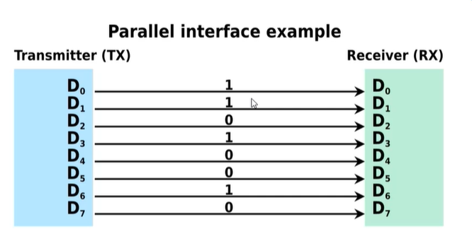
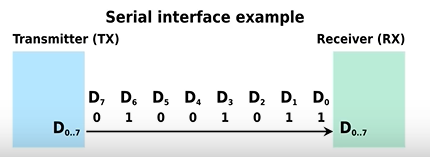
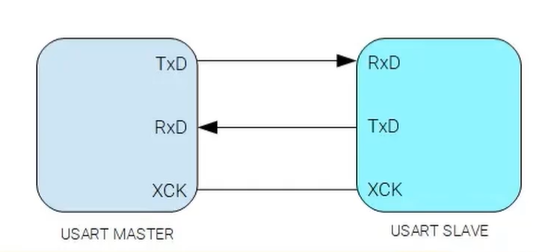
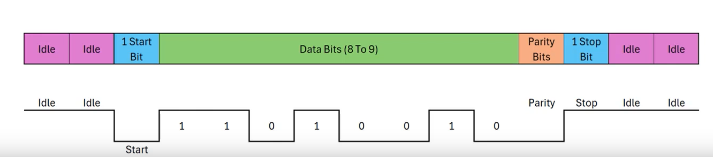

# UART Haberleşme

**Gün 06 · 27 Temmuz 2026 · Tiremo Cortex**

Bu not **teori** notudur. Okuduktan sonra uygulamaya geç: [`02_Gorevler.md`](02_Gorevler.md) (Debug Library).

### Bu notu nasıl kullanmalısın?

1. Seri / paralel ve senkron / asenkron farkını anla.  
2. UART frame’ini (start–data–parity–stop) öğren.  
3. TX / RX ve baud rate’in neden aynı olması gerektiğini bil.  
4. Görevlere geçip kendi Debug Library’ni yaz.

---

## 1. Seri ve paralel haberleşme

### Paralel haberleşme

Veri, **aynı anda birden fazla hat** üzerinden (birden fazla bit birlikte) iletilir. Hızlıdır ama çok hat ister; uzun mesafe için uygun değildir.

### Seri haberleşme

Veri **tek hat üzerinden bit bit** gönderilir. Hat sayısı azdır; uzun mesafede daha uygundur. Hız genelde paralelden düşüktür. Örnek protokoller: **UART**, SPI, I2C, RS-232.

| | Paralel | Seri |
|---|---------|------|
| Hat sayısı | Çok | Az (UART’ta TX/RX) |
| Hız | Genelde yüksek | Genelde daha düşük |
| Mesafe | Kısa | Daha uygun |
| Örnek | Eski bellek bus’ları | UART, SPI, I2C |

---

## 2. Senkron ve asenkron haberleşme

### Senkron

Alıcı ve verici **aynı saat sinyali (clock)** ile çalışır. Veri, clock’un kenarında örneklenir. Örnek: SPI, I2C, işlemci–RAM yolları.

| | |
|---|---|
| **Avantaj** | Yüksek hız, zamanlama hatası riski daha düşük, kesintisiz akış |
| **Dezavantaj** | Clock için ekstra hat; donanım ve tasarım daha karmaşık |

### Asenkron

Ortak clock **yoktur**. Her taraf kendi saatine göre çalışır. Senkronizasyon **start / stop bitleri** ile yapılır. Örnek: **UART**.

| | |
|---|---|
| **Avantaj** | Extra clock hattı yok; basit ve ucuz; uzun mesafe için uygun |
| **Dezavantaj** | Start/stop overhead → verimlilik düşer; hız genelde daha düşük; zamanlama hatası riski daha yüksek |

---

## 3. UART ve USART nedir?

### USART

**USART** hem **senkron** hem **asenkron** seri iletişimi destekleyebilir. Senkron modda data + clock hattı vardır; clock’un yükselen/düşen kenarında bit iletilir. Tipik olarak daha fazla pin gerekir (ör. Tx, Rx, XCK).

### UART

**UART** asenkron çalışır: cihazlar arasında **ortak clock olmadan** veri taşır. Basit ve düşük maliyetlidir.

- Veri gönderilmeden önce **start bit** ile “gönderim başlıyor” denir.  
- Gönderim bitince **stop bit** gelir.  
- İsteğe bağlı **parity bit** ile basit hata kontrolü yapılabilir.  
- Veri alanı genelde **7 / 8 / 9 bit** olabilir.  
- Hız **baud rate (bps)** ile ayarlanır: saniyede iletilen bit sayısı.  
  Örnek standartlar: 4800, 9600, 19200, **115200** bps.  
- **Kritik kural:** Alıcı ve verici aynı baud rate ve aynı frame ayarında olmalı.

### TX ve RX

UART tipik olarak **2 pin** kullanır:

| Pin | Anlam |
|-----|--------|
| **TX** | Transmit — veri gönderir |
| **RX** | Receive — veri alır |

Bağlantı kuralı (çapraz):

- Cihaz A’nın **TX** → Cihaz B’nin **RX**  
- İki yönlü ise ayrıca A’nın **RX** ← B’nin **TX**

Tek yönlü log (MCU → PC terminal) için çoğu zaman MCU **TX** yeterlidir; yine de RX pinini peripheral’da doğru tanımlamak gerekir.

---

## 4. UART veri formatı (frame)

UART’ta veri bir **çerçeve (frame)** olarak gider. Baud rate, her bitin süresini belirler. TX boştayken hat **idle**’dır ve genelde **logic 1**’dedir. Gönderim başlayınca ilk bit **logic 0** (start) olur.

### Frame bileşenleri

| Parça | Değer / uzunluk | Amaç |
|-------|-----------------|------|
| **Idle** | Logic 1 | Hat boş |
| **Start bit** | 0 · 1 bit | “Veri başlıyor” |
| **Data bits** | Genelde 8 (5–9) | Asıl bilgi (ör. bir karakter) |
| **Parity bit** | Opsiyonel · 1 bit | Basit hata kontrolü |
| **Stop bit** | 1 · genelde 1 (veya 2) bit | “Frame bitti” |

### Parite (kısa)

| Tip | Mantık |
|-----|--------|
| **Even (çift)** | 1’lerin sayısı çift olacak şekilde parity ayarlanır |
| **Odd (tek)** | 1’lerin sayısı tek olacak şekilde |
| **None** | Parite yok (debug’da en sık bu: **8N1**) |

**8N1** = 8 data bit · No parity · 1 stop bit.

---

## 5. Bugün bunları neden öğreniyoruz?

Tiremo Cortex’te bilgisayara log yazmak için **debug UART** kullanılır (USB-C üzerinden seri port).  

Teori: UART nasıl paketler, TX/RX ne demek, baud neden eşleşmeli.  
Uygulama: Şemadan hangi UART/pin → peripheral ayarı → kendi **Debug Library** (`Debug_Print`).

Sıradaki dosya: [`02_Gorevler.md`](02_Gorevler.md)
