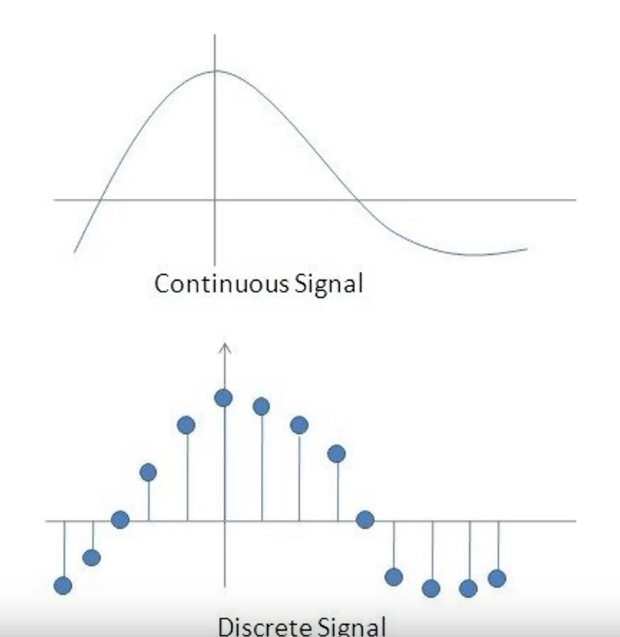
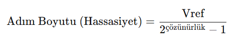
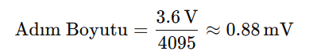

# ADC & Pil Gerilimi Okuma

**Gün 07 · 28 Temmuz 2026 · Tiremo Cortex**

Bu not **teori** notudur. Okuduktan sonra uygula: [`02_Gorevler.md`](02_Gorevler.md).

### Bu notu nasıl kullanmalısın?

1. ADC’nin ne yaptığını anla (analog → dijital).  
2. Çözünürlük, Vref, kanal, adım boyutu formülünü öğren.  
3. Şema + datasheet’te pil pin / kanal araştırmasını yap.  
4. Görevde pil voltajını oku; terminalde **5 saniyede bir** göster.

---

## 1. ADC nedir?

**ADC** = *Analog to Digital Converter* (Analog–Dijital Dönüştürücü).

Gerçek dünyada pil gerilimi gibi büyüklükler **sürekli (analog)** değişir. Mikrodenetleyici ise sadece **0 ve 1** anlar. ADC, sürekli sinyali örnekleyip işlenebilir bir **sayıya** çevirir.



| Sinyal | Anlam |
|--------|--------|
| **Sürekli (analog)** | Her an ara değer olabilir (ör. 3.71 V → 3.70 V…) |
| **Ayrık (dijital)** | Belirli anlarda alınmış değerler → 0, 1, 2, … 4095 |

Kısaca: **Pil gerilimi analogdır → ADC onu sayıya çevirir → sen kodda bu sayıyla çalışırsın.**

> Tiremo Cortex’te kesin bit sayısı, Vref ve kanal bilgisini **A34G43x datasheet + kart şemasından** doğrula. Aşağıdaki sayılar öğretici örnektir.

---

## 2. ADC’nin temel özellikleri

### 2.1 Çözünürlük (resolution)

| Çözünürlük | Seviye sayısı | Anlam |
|------------|---------------|--------|
| 8 bit | \(2^8 = 256\) | Kaba |
| 10 bit | \(2^{10} = 1024\) | Orta |
| 12 bit | \(2^{12} = 4096\) | Daha hassas |

12 bit → ham değer genelde **0 … 4095** (\(2^n - 1\)).

### 2.2 Gerilim aralığı ve Vref

ADC genelde **0 … Vref** arasını ölçer.

- Vref kart / MCU’ya göre 3.3 V veya benzeri olabilir.  
- Vref’ten yüksek gerilim doğrudan ADC pinine verilmemeli.  
- Pil 4.2 V civarına çıkabilir → kartta çoğu zaman **gerilim bölücü** vardır. ADC pininde gördüğün voltaj, pilin tamamı olmayabilir.

### 2.3 Kanal (channel)

Her analog giriş bir **ADC kanalına** bağlıdır.

Kritik soru:

> Batarya sense hattı hangi MCU pin’ine geliyor ve bu pin hangi ADC kanalı?

Cevabı tahmin etme → **şema + datasheet**.

### 2.4 Hız vs çözünürlük

Çözünürlük arttıkça dönüşüm genelde uzar. Pil izleme için çok yüksek hız gerekmez.

---

## 3. ADC çevrim modları (kısa)

| Mod | Ne yapar? |
|-----|-----------|
| **Tek çevrim (Single)** | Bir ölçüm alır, durur |
| **Sürekli (Continuous)** | Bitince yeniden başlar |
| **Tarama (Scan)** | Birden fazla kanalı sırayla ölçer |
| **Süreksiz** | Tetik geldikçe grup içinden ölçer |

Bugün odak: **tek kanal — pil**.

---

## 4. Voltaj nasıl hesaplanır?

Ham ADC değeri tek başına “volt” değildir.



\[
\text{Adım boyutu} = \frac{V_{ref}}{2^{n} - 1}
\]

Örnek (12 bit, Vref = 3.6 V):



\[
\text{Adım} = \frac{3.6}{4095} \approx 0.88\,\text{mV}
\]

Pratik çeviri:

\[
V_{adc} = \text{raw} \times \frac{V_{ref}}{2^{n} - 1}
\]

### Bölücü varsa

\[
V_{pil} = V_{adc} \times k
\]

\(k\)’yı şemadaki dirençlerden hesapla veya kart dökümanından oku.

### Mini örnek

12 bit, Vref = 3.3 V, raw = 2048, bölücü yok:

\[
V = 2048 \times 3.3 / 4095 \approx 1.65\,V
\]

---

## 5. Datasheet / şema — ne araştıracaksın?

### A) Kart dökümanı / şema

| Soru | Cevabın |
|------|---------|
| Pil sense net’inin adı? (VBAT, BAT_ADC, …) | |
| Hangi MCU pin’i? (port + pin) | |
| Gerilim bölücü var mı? Dirençler? | |
| Bölücü oranı \(k\)? | |

### B) MCU datasheet (A34G43x — ADC)

| Soru | Cevabın |
|------|---------|
| Bu pin hangi **ADC kanalı**? | |
| Çözünürlük kaç bit? | |
| Vref kaynağı / tipik Vref? | |
| Max giriş voltajı? | |

### Araştırma sırası

```
1. Şemada BAT / VBAT hattını bul
2. Hangi pin’e gittiğini yaz
3. Datasheet’te pin → ADC channel tablosunu bul
4. Vref ve bit sayısını netleştir
5. raw → mV (ve gerekirse × k) formülünü yaz
```

**Kanal yanlışsa ölçüm yanlış olur.**

---

## 6. Sonraki adım

1. Bu teoriyi bitir.  
2. Şema / datasheet tablosunu doldur.  
3. [`02_Gorevler.md`](02_Gorevler.md) → pil voltajını oku, terminalde 5 sn’de bir göster.  
4. Teorik soruları rapora cevapla.
