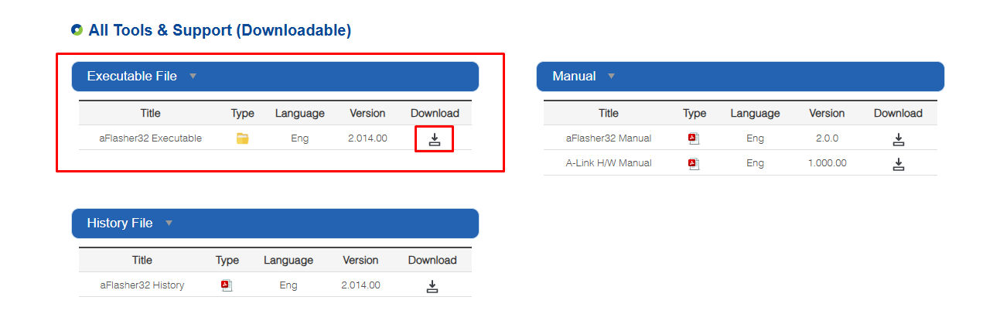
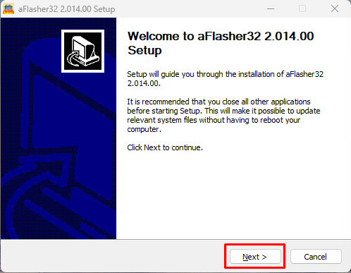
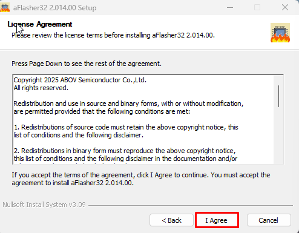
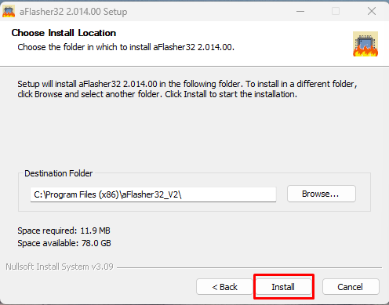
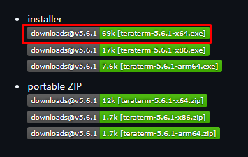

# Development Environment Setup

This guide covers the installation of all software tools required to participate in the **Tiremo® Accelerator Workshops** activities. Complete every installation below before starting the workshop.

---

## Table of Contents

- [Required Tools](#required-tools)
- [1. eMStudio32 Installation](#1-emstudio32-installation)
- [2. MCUBrew32 Installation](#2-mcubrew32-installation)
- [3. aFlasher32 Installation](#3-aflasher32-installation)
- [4. Tera Term Installation](#4-tera-term-installation)
- [5. Visual Studio Code Installation](#5-visual-studio-code-installation)
- [6. ESP-IDF Extension Setup (Recommended)](#6-esp-idf-extension-setup-recommended)
- [7. Alternative ESP-IDF Installation Methods](#7-alternative-esp-idf-installation-methods)
  - [7.1 Windows](#71-windows)
  - [7.2 macOS / Linux](#72-macos--linux)
- [8. Installation Verification](#8-installation-verification)
- [Useful Commands](#useful-commands)
- [Resources](#resources)


## Required Tools

| Tool | Description |
|------|-------------|
| **eMStudio32** | Integrated development environment (IDE) for ABOV microcontrollers |
| **MCUBrew32** | Project creation and configuration tool |
| **aFlasher32** | Flash programming tool for loading binary files onto the board |
| **Tera Term** | Terminal emulator for serial port communication |

---

## 1. eMStudio32 Installation

eMStudio32 is an integrated development environment (IDE) for ABOV microcontrollers. It lets you write, build, and debug code from a single interface.

### Resources

- 🌐 **Official Download Page:** [ABOV Tools & Support — eMStudio32](https://www.abov.co.kr/en/tools_support/debug_tools.php?category=eMStudio32)
- 📖 **User Manual:** [eMStudio32 Manual & Release Notes](https://abov.atlassian.net/wiki/spaces/ES2/pages/1558413356/Manual+Release)
- 📋 **Installation Steps:** [eMStudio32 Installation Guide](https://abov.atlassian.net/wiki/spaces/ES2/pages/1752858627/Installation)
- 📄 **Local Document:** [ES2 Installation (PDF)](Document/ES2-Installation-200526-125944.pdf)

### Installation Steps

1. Go to the official download page above and download the installer.
2. Run the downloaded installer.
3. Follow the steps in the [installation documentation](https://abov.atlassian.net/wiki/spaces/ES2/pages/1752858627/Installation) to complete setup.
4. **Launch eMStudio32 from the Start Menu / desktop shortcut** created by the installer — do not open the project folder with a generic Eclipse install.
5. After installation, confirm that **Windows Build Tools** (`make.exe`) are present, for example:

   ```
   <eMStudio32 install>\bin\xpack-windows-build-tools-*\bin\make.exe
   ```

   Typical install locations:

   - `C:\ABOV\eMStudio32\`
   - `C:\Program Files (x86)\ABOV\eMStudio32\`

### eMStudio32 build troubleshooting

| Error | Cause | Fix |
|-------|-------|-----|
| `Program "make" not found in PATH` | eMStudio32 build tools not installed, incomplete install, or IDE started outside the official launcher | Repair/reinstall eMStudio32; start from the **eMStudio32** shortcut; verify `make.exe` exists under `bin\xpack-windows-build-tools-*\bin\` |
| PATH shows `C:\ABOV\eMStudio32\...` but IDE is under `Program Files (x86)` | Toolchain path mismatch from a copied workspace or partial install | Reinstall to one location, or add the correct `xpack-windows-build-tools-*\bin` folder to Windows **PATH** |
| `ld.exe: unrecognized option '--no-warn-rwx-segment'` | Linker flag needs GCC 12+; eMStudio32 ships **GCC 10.3** | Use the workshop repo as-is (flag removed); run **Project → Clean…** then **Build** |

> **Workshop note:** The Tiremo Eclipse project is tested with the **GNU Arm Embedded Toolchain bundled in eMStudio32 (GCC 10.3, 2021.10)**. Do not add linker flags that require a newer GCC unless every participant uses the same upgraded toolchain.

---

## 2. MCUBrew32 Installation

MCUBrew32 is a tool for code generation and peripheral configuration in ABOV microcontroller projects.

### Resources

- 🌐 **Official Download Page:** [ABOV Tools & Support — MCUBrew32](https://www.abov.co.kr/en/tools_support/debug_tools.php?category=mcubrew32)
- 📖 **User Manual:** [MCUBrew32 User Guide](https://abov.atlassian.net/wiki/spaces/MCUBrew321/pages/760250452/Manual+Release)
- 📋 **Installation Steps:** [MCUBrew32 Installation and Getting Started](https://abov.atlassian.net/wiki/spaces/MCUBrew321/pages/1379565598/Installation+and+Getting+Started)
- 📄 **Local Document:** [MCUBrew32 Installation (PDF)](Document/MCUBrew321-Installing%20and%20uninstalling%20the%20MCUBrew32%20program-200526-123146.pdf)

### Installation Steps

1. Go to the official download page above and download the installer.
2. Run the downloaded installer and follow the setup steps.
3. Installation is complete when the **"Installation Complete"** screen appears at **step 6** of the installation guide.

---

## 3. aFlasher32 Installation

aFlasher32 is a flash programming tool used to load compiled binary files onto the **Tiremo®Cortex** board.

### Installation Steps

**Step 1 —** Go to [ABOV Tools & Support — aFlasher32](https://www.abov.co.kr/en/tools_support/debug_tools.php?category=aflasher32).



**Step 2 —** Under *All Tools & Support (Downloadable)*, download the **aFlasher32 Executable** `.exe` file from the **Executable File** column.

**Step 3 —** Extract the `.exe` installer from the downloaded `.zip` archive and run the setup program.

**Step 4 —** Complete the installation by following these steps:

**→** Click **Next** on the setup screen.



**→** Accept the license agreement.



**→** Choose the installation location and click **Install**.



**→** Click **Finish** to complete the installation.


---

## 4. Tera Term Installation

Tera Term is a terminal emulator used to communicate with **Tiremo®Cortex** over a serial port. This workshop uses Tera Term; you may use any serial terminal application you prefer.

### Installation Steps

**Step 1 —** Go to [https://teratermproject.github.io/index-en.html](https://teratermproject.github.io/index-en.html).

**Step 2 —** Click the latest release under **Download**.


**Step 3 —** On the release page, download the installer from the **installer** section.



**Step 4 —** Run the downloaded `.exe` file and complete the installation.

---

### Setup Complete ✓

